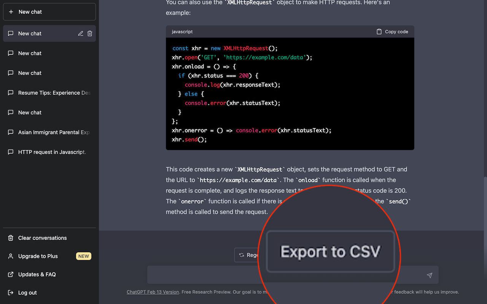

# ChatGPT Enhancement Suite

Introducing the ChatGPT Chrome Extension - an extension designed to enhance your experience with ChatGPT's web interface.

With this extension, you can now export your chat history to a CSV file, allowing for easy analysis and manipulation of your data. This chrome extension is open source and the source code can be found on https://github.com/kevincolemaninc/chatgpt-enhancement-suite.

Please create an issue or PR if you have features you want to add or request.

# Screenshots
Export to CSV

## Features
  [x] - Export to CSV
  [ ] - Export all to CSV
  [ ] - Export to PNG
  [ ] - Prompt Engineering
  [ ] - Share Chat


## Publishing to the store

Bump version in `manifest.json`

```
make build
```

Upload the zip file in `dst` to the chrome store
